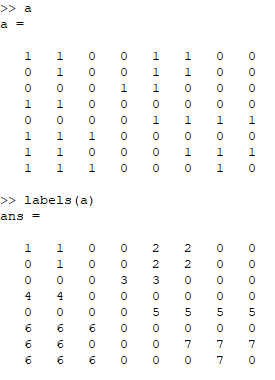

# MATLAB-Image-Label

### Image Processing

Labelling 4-Way connected components in a BW Image.
--------
* I have taken a matrix `a` which in similar to 2-D pixel array of an BW image containing 1 & 0.
* I have given priority to left pixel over top pixel.
* For 4-Way labelling I check only the intensity of left & top pixel of a particular pixel.  
* If the intensity matches I label accordingly. 

  

